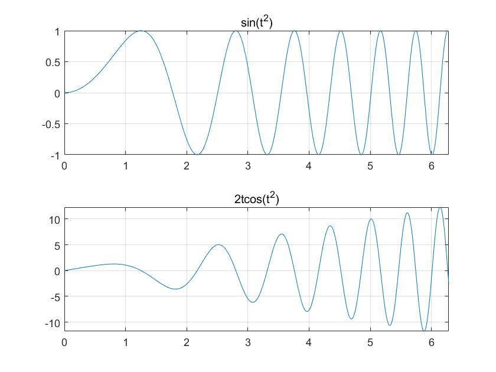
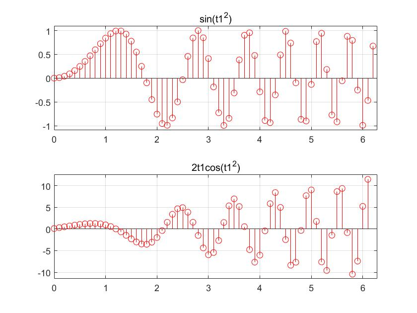
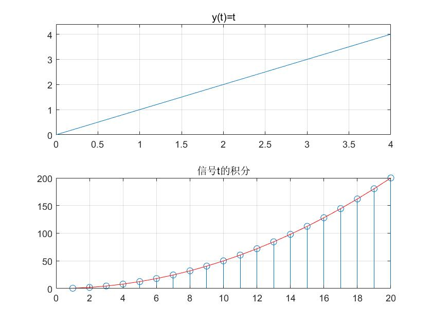
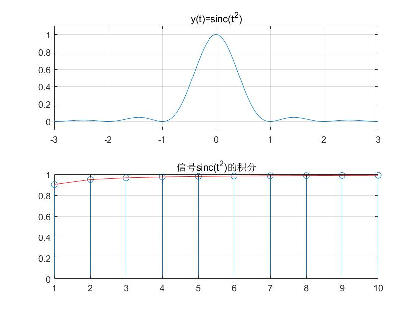

###### 	这部分主要是导数和差分以及积分，求导对应连续信号，差分对应离散信号

###### This part is mainly about diff and integral

- Part I

  ```matlab
  %导数
  
  syms t y z   %define symbolic variables
  y = sin(t^2);
  z = diff(y);
  figure(1)
  subplot(2,1,1)
  fplot(y,[0,2*pi]);  %plot within the scope
  title('sin(t^2)');
  grid
  hold on
  subplot(2,1,2)
  fplot(z,[0,2*pi]); 
  title('2tcos(t^2)');
  grid
  ```
  
  The result graph is as follows:
  
  
  
  
  
  
  
- Part II
  
  ```matlab
  %差分 discrete signal is diff
  
  Ts = 0.1;
  t1 = 0:Ts:2*pi;
  y1 = sin(t1.^2);
  z1 = diff(y1)./diff(t1);
  figure(2)
  subplot(2,1,1)
  stem(t1,y1,'r');
  axis([0 2*pi 1.1*min(y1) 1.1*max(y1)])
  title('sin(t1^2)');
  grid
  hold on
  subplot(2,1,2)
  stem(t1(1:length(y1)-1),z1,'r');  %注意观察，在离散时间信号中，
  axis([0 2*pi 1.1*min(z1) 1.1*max(z1)])
  title('2t1cos(t1^2)');
  grid
  ```
  
  The result graph is as follows:
  
  
  
  
  
- Part III
  
  ```matlab
  clf;clear all
  
  syms t z s 
  
  for k = 1:20 %每个点都算一次积分，把数值储存在zz中
      z = int(t,t,0,k);  %int(被积函数，被积变量，积分起始点，积分终止点)
      zz(k) = subs(z);
  end
  
  t1 = linspace(-4,4);
  y = t1;
  n = 1:20;
  subplot(2,1,1);
  plot(t1,y);grid;
  axis([0 4 0 1.1*max(y)]);
  title('y(t)=t');
  subplot(2,1,2)
  stem(n(1:20),zz(1:20));hold on
  plot(n(1:20),zz(1:20),'r');grid;
  title('信号t的积分');
  hold off
  ```
  
  The result graph is as follows:
  
  
  
- Part IV
  
  ```matlab
  clf;clear all
  
  syms t z s 
  
  for k = 1:10 %每个点都算一次积分，把数值储存在zz中
      z = int(sinc(t)^2,t,0,k);  %int(被积函数，被积变量，积分起始点，积分终止点)
      zz(k) = subs(2*z);%偶函数要乘2？（存疑）
  end
  
  n = 1:10;
  subplot(2,1,1); 
  fplot(sinc(t)^2);grid;
  axis([-3 3 -0.1 1.1]);
  title('y(t)=sinc(t^2)');
  subplot(2,1,2)
  stem(n(1:10),zz(1:10));hold on
  plot(n(1:10),zz(1:10),'r');grid;
  title('信号sinc(t^2)的积分');
  hold off
  ```
  
  The result graph is as follows:
  
  


  
