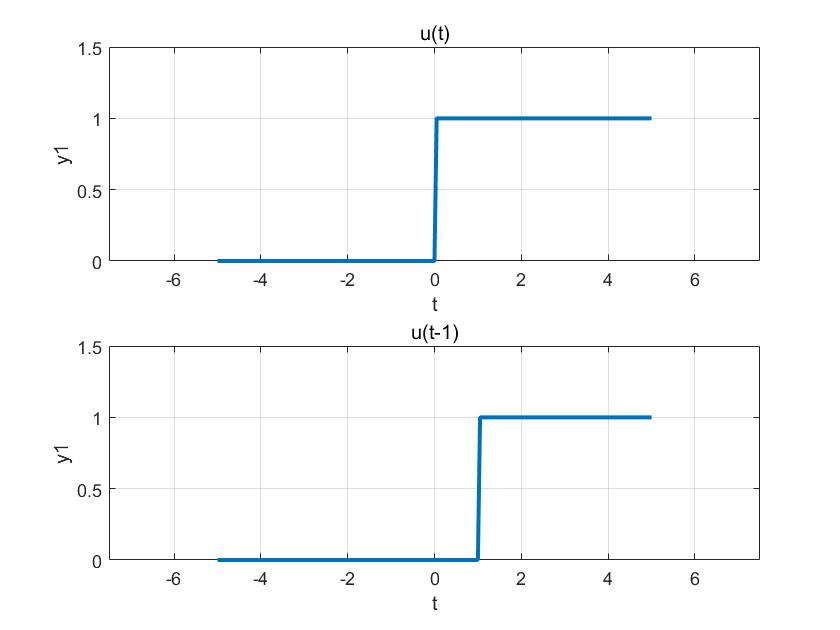
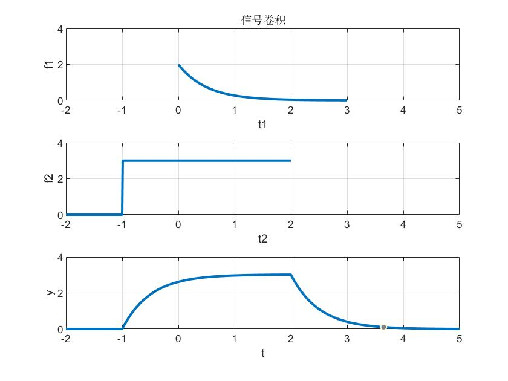

# 连续时间系统的时域分析

### 产生阶跃信号

编写函数

```matlab
function y = ustep(t,ad)
% 产生单位阶跃信号
% t:时间
% ad:时移因子，正值代表左移，负值代表右移
N = length(t);
y = zeros(1,N);
for i = 1:N
    if t(i)>ad
        y(i) = 1;
        
    end       
end
end
```

调用函数生成阶跃信号

```matlab
% 产生阶跃信号
Ts = 0.05;
t = -5:Ts:5;
y1 = ustep(t,0);
y2 = ustep(t,1);

subplot(2,1,1)
plot(t,y1,'LineWidth',2)
grid;
axis([1.5*min(t) 1.5*max(t) 1.5*min(y1) 1.5*max(y1)]);
xlabel('t')
ylabel('y1')
title('u(t)')
subplot(2,1,2)
plot(t,y2,'LineWidth',2)
grid;
axis([1.5*min(t) 1.5*max(t) 1.5*min(y2) 1.5*max(y2)]);
xlabel('t')
ylabel('y1')
title('u(t-1)')
```



### 信号卷积

```matlab
% 信号卷积
clear;
T = 0.01;
t1 = 0:T:3;
t2 = -2:T:2;
f1 = 2*exp(-2*t1); % 产生指数信号
f2 = 3*(ustep(t2,-1)-ustep(t2,2)); % 产生阶跃信号

y = conv(f1,f2);
y = y*T; % 这一步骤注意，存疑，不过也能看出来
t = -2:T:5; % 卷积后的定义域
subplot(3,1,1);
plot(t1,f1,'LineWidth',2)
grid;
axis([-2 5 0 4]);
xlabel('t1')
ylabel('f1')
title('信号卷积')
subplot(3,1,2);
plot(t2,f2,'LineWidth',2) % 这张图右边界由于定义域看不出来，没有关系
grid;
axis([-2 5 0 4]);
xlabel('t2')
ylabel('f2')
subplot(3,1,3);
plot(t,y,'LineWidth',2)
grid;
axis([-2 5 0 4]);
xlabel('t')
ylabel('y')
```



