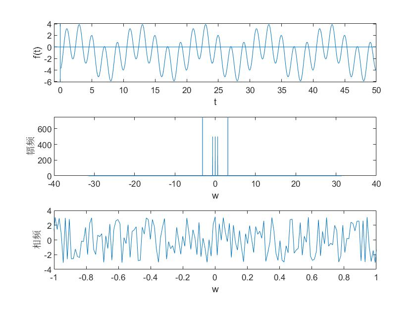
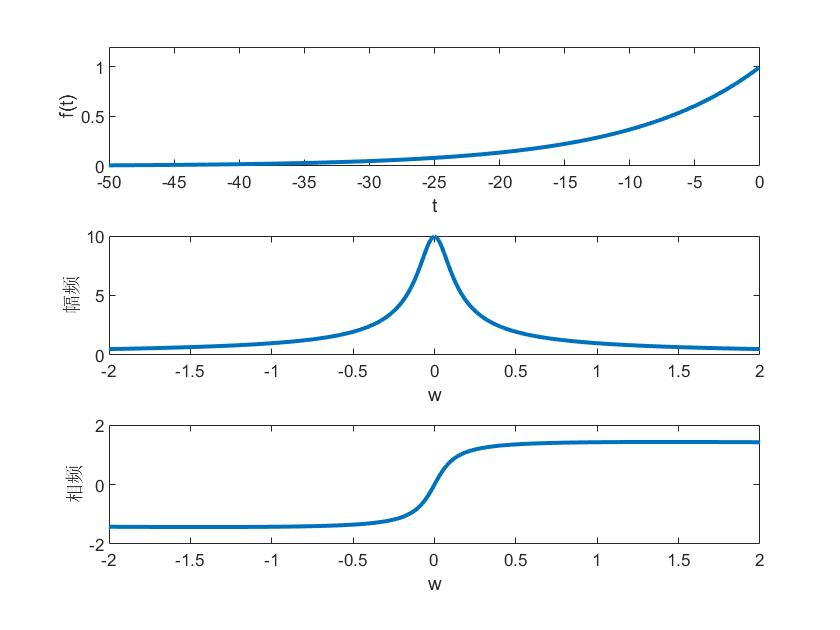
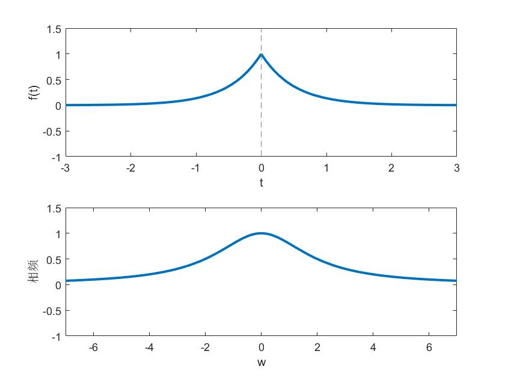

# 傅里叶级数与傅里叶变换

### 周期信号的傅里叶级数

画周期信号幅频谱：

```matlab
%周期信号的傅里叶级数
%画出周期信号幅频谱
figure
N = 5000;
T = 0.1;
n = 1:N;  %5000个数据点 时间间隔 0.1s
D = 2*pi/(N*T);  %将时间域转换成频域  频域间隔0.004pi 因为fft横轴代表的是点数，所以要乘以D来转换成角频率
f = -1+2*sin(0.2*pi*n*T)-3*cos(pi*n*T);
F = fftshift(fft(f))*T;     %除以N是因为DFT的频谱除以信号长度才是真实的周期信号傅里叶级数值
k = floor(-(N-1)/2:N/2);    %将正域的5000个点转移至正负域，k都是整数
subplot(311)
plot(n*T,f);
xlabel('t')
ylabel('f(t)')
axis([-1 50 -6.1 4.1]);
line([-1,50],[0,0]);
line([0,0],[-6.1,4.1]);
subplot(312) 
plot(k*D,abs(F)) %注意w和F的点数要一样
xlabel('w')
ylabel('幅频')
% axis([-6 6 -0.1 3]);
subplot(313) 
plot(k*D,angle(F)) %注意w和F的点数要一样
xlabel('w')
ylabel('相频')
axis([-1 1 -4 4]);
```




### 非周期信号的傅里叶变换

```matlab
%非周期信号的傅里叶变换

%fourier()是算符号表达式的傅里叶变换的，算出来结果要画图可以用ezplot();
%fft()是算有限长离散序列的离散傅里叶变换的，算出来的结果画图要用stem()或者plot();

%单边指数函数
figure(2)
N = -5000;
T = 0.1;
n = -1:-1:N;
D = 2*pi/(N*T); 
m = n*T;
f = exp(0.1*m);
F = fftshift(fft(f))*T; %照葫芦画瓢
k = floor(-(-N-1)/2:-N/2);    
subplot(311)
plot(m,f,'LineWidth',2);
xlabel('t')
ylabel('f(t)')
axis([-50 0 0 1.2]);

subplot(312) 
plot(k*D,abs(F),'LineWidth',2)
xlabel('w')
ylabel('幅频')
axis([-2 2 0 10]);

subplot(313) 
plot(k*D,angle(F),'LineWidth',2)
xlabel('w')
ylabel('相频')
axis([-2 2 -2 2]);

```



```matlab
%双边指数函数，无法使用上述方法，因为n = 1:N;无法生成对称的自变量

figure(3)
clear
syms t v;
F = fourier(exp(-2*abs(t))); %傅里叶变换就是对非周期信号求得其F(w)
figure(1)
subplot(2,1,1);
fplot(exp(-2*abs(t)),'LineWidth',2);
xlabel('t')
ylabel('f(t)')
axis([-3 3 -1 1.5]);
subplot(212);
fplot(F,'LineWidth',2);
xlabel('w')
ylabel('相频')
axis([-7 7 -1 1.5]);
```

